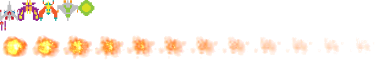

# cit281-lab9

## Lab Goals and Objectives 
1. Create Learning Lab course/repo within your GitHub account
2. Practice exiting and returning to the course from course repo
3. Work through course
4. Download completed course repo as deliverable

### Lab Deliverables
1. [MIT-LICENSE.txt](MIT-LICENSE.txt)
2. [base.css](base.css)
3. [engine.js](engine.js)
4. [game.js](game.js)
5. [game.manifest](game.manifest)
6. [index.html](index.html)
7. [README.md](README.md)
8. sprites.png
- 
